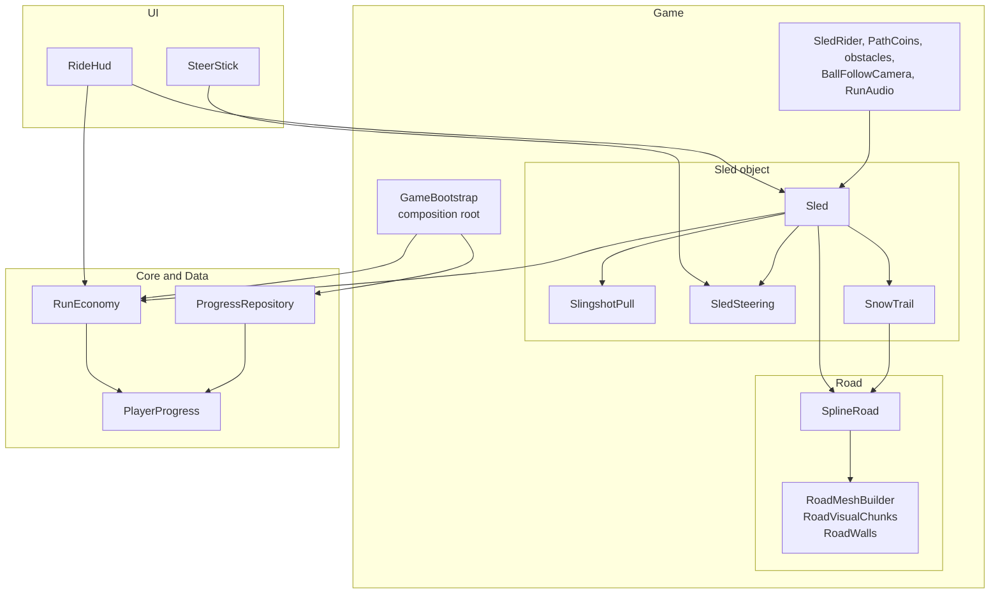
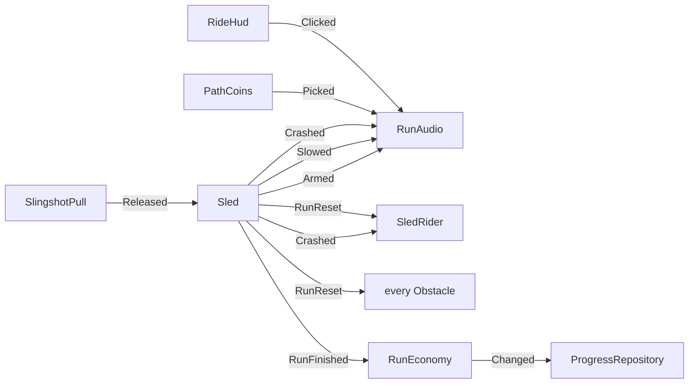
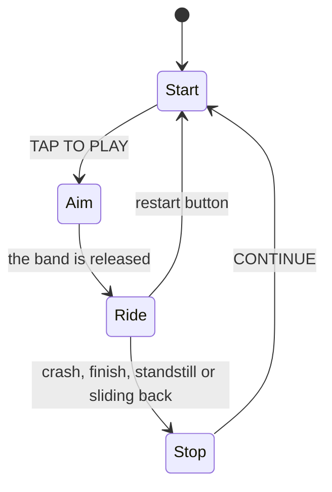
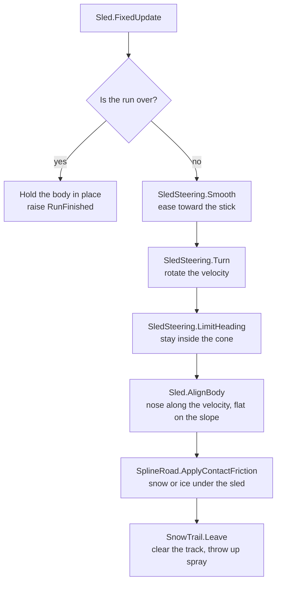
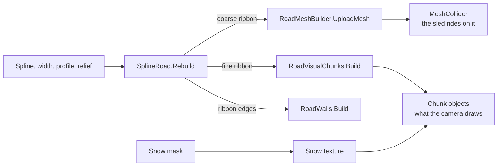

# TechDesign — project architecture

A runner prototype in the style of Sled Surfers: a slingshot launch, a ride down a snowy road, steering, obstacles, coins, and upgrades between runs.

Unity `6000.5.11f1`, URP, the Input System and the Splines package. One scene: `Assets/_Game/Scenes/SampleScene.unity`.

---

## 1. Layers

An arrow reads "uses". Nothing in Core or Data points back at the scene.

| Layer | Folder | Contents | Depends on |
|-------|--------|----------|------------|
| **Core** | `Scripts/Core` | Coin and upgrade rules, the slingshot aim maths. Plain C# classes. | Nothing in the scene |
| **Data** | `Scripts/Data` | The saved progress and a repository on `PlayerPrefs`. | Nothing |
| **Game** | `Scripts/Game` | Objects of the scene: road, sled, rider, coins, obstacles, camera, sound, composition root. | Core |
| **UI** | `Scripts/UI` | The HUD and the steer stick. | Game, Core |
| **Editor** | `Scripts/Editor` | Level tools and cheats. | Game, Core, Data |

Core and Data know nothing about `MonoBehaviour`, Canvas or the scene. The UI does not compute rules and does not write the save: it shows ready values and calls methods.

---

## 2. How the code is split

Each class has one reason to change. The two classes that used to hold several jobs are split along those jobs.

**The sled** is five components on one object. `Sled` owns the body and the state of the run, and calls the others in a fixed order on each step:

| Class | Its one job |
|-------|-------------|
| `Sled` | The rigidbody, the run state (armed, riding, stopped), the end-of-run rules, collisions. |
| `SlingshotPull` | Reading the pull, drawing the band and the shot line, reporting the release. |
| `SledSteering` | Turning the stick into a heading change, and holding the heading inside a cone. |
| `SnowTrail` | The cleared track in the snow mask and the spray of flakes. |
| `SledRider`, `SlideFacing` | The rider's poses, and where the model sits on the snow. |

**The road** is one component and three helpers. `SplineRoad` keeps the data that is saved with the level and answers questions about the surface. What it builds from that data is not its job:

| Class | Its one job |
|-------|-------------|
| `SplineRoad` | The surface model: spline, width, profile, relief, snow mask, friction, and the queries on them. |
| `RoadMeshBuilder` | Pure geometry: arrays of vertices in, Unity meshes out. No state. |
| `RoadVisualChunks` | The drawn surface: chunk objects, their meshes, and the private copy of the road material. |
| `RoadWalls` | The two invisible side walls. |

Other places where the same principles show:

- **New behaviour without editing old code.** An obstacle type is a subclass of `Obstacle` with one method, `Apply`. The sled and the composition root never check which type they hit.
- **Small surfaces between classes.** `SledSteering` and `SnowTrail` are told what they need (the body, the ground normal, the road point) and never look anything up. `RoadMeshBuilder` sees only arrays.
- **Dependencies point inward.** Rules (`RunEconomy`) and data (`ProgressRepository`) do not know who uses them. `GameBootstrap` creates them and hands them out, and the only thing that knows about saving is the line that connects `RunEconomy.Changed` to `ProgressRepository.Save`.
- **Callers depend on the narrowest thing.** The stick talks to `SledSteering`, not to the whole sled. The HUD reads the tension from `SlingshotPull`. The audio reads the stick from `SledSteering`.

---

## 3. Composition root

`GameBootstrap` is the only place that creates objects outside the scene and connects events. It runs before the other scripts (`DefaultExecutionOrder(-100)`), once, in `Awake`:

1. Creates `ProgressRepository`, loads `PlayerProgress`, creates `RunEconomy`.
2. Hands the economy to the objects that read it: `Sled.Initialize`, `RideHud.Initialize`.
3. Subscribes the events (the table in §5).
4. Collects every `Obstacle` under its obstacle roots (`Obstacles` and `Decor`) and subscribes it to the restart.
5. In `Start`, and again on every restart, places the two `DistanceGate` walls: the finish one at `Sled.FinishMeters`, the record one at `RunEconomy.BestDistanceMeters`. The record wall is left out while there is no record, or when it would stand on the start pad or on the finish.

How dependencies are wired:

- **A scene object or an asset** is a `[SerializeField]` field set in the inspector. Game code has no `Find*`, no `Camera.main` and no `Resources.Load`.
- **A component on the same object** is taken with `GetComponent` and guaranteed by `RequireComponent`. `Sled` gets `SlingshotPull`, `SledSteering` and `SnowTrail` this way.
- **A plain C# object** (`RunEconomy`) arrives through `Initialize` from `GameBootstrap`.
- **Events** are subscribed by `GameBootstrap`.

---

## 4. Scene objects

| Object | Components | Role |
|--------|------------|------|
| `Game` | `GameBootstrap` | Composition root. |
| `Level1_Road` (prefab) | `SplineRoad`, `SplineContainer`, `MeshCollider` | The road: geometry, relief, snow, friction. |
| `Slider` | `Rigidbody`, `CapsuleCollider`, `Sled`, `SlingshotPull`, `SledSteering`, `SnowTrail`, `SledRider` | The sled. |
| `Slider/Visual` | `SlideFacing` | The point the model hangs on. It is planted on the snow and tilted with the slope. |
| `Slider/SnowSpray`, `PullLine`, `ShotLine` | `ParticleSystem`, `LineRenderer` | Snow spray and the aim lines. Code only turns them on and sets their points. |
| `Main Camera` | `BallFollowCamera` | The camera behind the sled. |
| `Path Coins` | `PathCoins` | Coins along the road. |
| `Obstacles` | child `CrashObstacle` / `SlowObstacle` objects | The obstacles placed on the driving line. |
| `Best Gate`, `Finish Gate` | `DistanceGate`, child `Wall` and `Fanfare` | The see-through walls at the best distance and at the finish, each with its confetti. |
| `Decor` | `DecorVisibility`, child `CrashObstacle` / `SlowObstacle` prefab instances | Street props along both sides of the run. Each one is an obstacle with a box collider. `DecorVisibility` switches on only the ones within range of the sled. |
| `HUD` | `Canvas`, `RideHud` | The whole interface. |
| `Steer Stick` | `Canvas`, `SteerStick` | The floating stick. |
| `Run Audio` | `AudioSource`, `RunAudio` | Every sound of a run. |
| `EventSystem` | | Input for the UI. |

The HUD hierarchy, the stick, the particles and the lines live in the scene and are not created by code. Code creates only what depends on data: the coins along the road, the pieces of generated road geometry, and the copy of the rider model.

---

## 5. Events

| Event | Raised by | Listener |
|-------|-----------|----------|
| `SlingshotPull.Released` | the band is let go | `Sled` launches itself |
| `Sled.Armed` | TAP TO PLAY is pressed | `RunAudio.PlaySitDown` |
| `Sled.Slowed` | a slowing obstacle | `RunAudio.PlaySlowHit` |
| `Sled.Crashed` | an obstacle that ends the run | `SledRider.PlayCrash`, `RunAudio.PlayCrash` |
| `Sled.RunFinished` | the run ends for any reason | `GameBootstrap` → `RunEconomy.CommitRun` |
| `Sled.RunReset` | the run returns to the start | `SledRider.StopCrash`, every `Obstacle.Restore`, `GameBootstrap` places the gates |
| `PathCoins.Picked` | a coin is picked up | `RunAudio.PlayCoin` |
| `RideHud.Clicked` | any HUD button | `RunAudio.PlayClick` |
| `RunEconomy.Changed` | coins or levels changed | `GameBootstrap` → `ProgressRepository.Save` |

Every arrow except the first is connected by `GameBootstrap`. The classes at the two ends do not know about each other.

The rest of the communication is polling through a direct reference: the HUD, the camera, the coins and the scenery read the properties of `Sled` every frame.

---

## 6. Run lifecycle

`Sled` holds the state of the run and exposes it through properties.

| State | Seen from outside as |
|-------|----------------------|
| Start | `PlayArmed` is false |
| Aim | `PlayArmed` is true, and `SlingshotPull.IsAiming` while the finger is down |
| Ride | `IsRiding` and `CanSteer` |
| Stop | `IsStopped`, then `ResultsReady` once the results card may appear |

| Phase | What happens |
|-------|--------------|
| **Start** | The sled sits at the start of the road, the body is kinematic. The HUD shows the upgrade shop. The rider stands facing the camera. |
| **Aim** | `Sled` asks `SlingshotPull` to read the pointer every frame. Pull length is speed, the angle is up to ±20° from the road axis. `SlingshotAim` snaps the angle to steps and computes the power lost at the edges. On release the sled scales the speed by the launch upgrade. |
| **Ride** | The body is dynamic. Every physics step, in this order: check for the end of the run, steer, align the capsule, write the friction, leave the snow trail. |
| **Stop** | The body is kinematic again and `RunFinished` is raised. After a crash the results card waits `crashResultsDelay` seconds while the fall plays. |

One physics step of the ride, in the order `Sled.FixedUpdate` runs it:

A run ends when the sled hits a `CrashObstacle`, reaches the finish (`finishFraction` of the spline length), stays in place for `restDelay` seconds, or starts sliding backward.

A restart increases `RunSerial` and raises `RunReset`. The coins watch `RunSerial` to know when to come back.

---

## 7. The road

**Surface coordinates.** Any point of the road is a pair `(t, u)`: `t` runs from 0 to 1 along the spline, `u` from 0 (left edge) to 1 (right edge). All road data is stored in these coordinates.

**What `SplineRoad` stores:**

- the width and the cross-section profile (a bowl or a crown, with keys along the road);
- the relief grid `sculptHeights`: 160 × 32 heights painted by the Road Sculpt tool;
- the snow mask: a byte per cell, where 255 is snow and 0 is cleared ice.

**What gets built from it.** `SplineRoad.Rebuild` samples the surface into vertex arrays twice and hands them on:

- a coarse ribbon goes to `RoadMeshBuilder.UploadMesh` and becomes the `MeshCollider` the sled rides on;
- a denser ribbon goes to `RoadVisualChunks.Build`, which cuts it into chunk objects so the camera draws only the near ones. Triangles stretched by steep relief are split by `RoadMeshBuilder`;
- the edges of the coarse ribbon go to `RoadWalls.Build`.

**Queries the rest of the code uses:**

| Method | Purpose |
|--------|---------|
| `TryGetSurfaceCoord(world, hintT, …)` | World point → `(t, u)`. With a `hintT` it searches a 48 m window around the last position, without one it searches the whole spline. |
| `TryGetSurface(t, u, …)` | `(t, u)` → the point on the surface, the tangent and the spline's up vector. |
| `TryRaycast` | A ray against the road collider that also recovers `(t, u)`. Used by the editor tools. |
| `FrictionAt`, `SnowCoverage` | Friction and snow coverage at a point. |
| `ClearSnowAlong` | Clears the snow along a segment: the sled's trail. |
| `ApplyContactFriction` | Writes the friction into the road's physics material. |

**Friction.** The sled has zero friction, and the road has whatever the sled wrote on this step. Snow slows more than ice, so riding in your own trail is faster. The `Friction` upgrade scales that value.

**Snow on screen.** The mask is uploaded to a texture and set on the material that `RoadVisualChunks` owns. The `RoadSnow` shader blends snow with ice by it and raises the vertices. A ride uploads only the rectangle that changed.

---

## 8. The sled

**Body (`Sled`).** A `Rigidbody` with frozen rotation and a `CapsuleCollider` lying along the Z axis, because the rider slides lying down. The capsule and the body are configured in the scene.

**Alignment (`Sled.AlignBody`).** The solver never rotates the body. Every physics step the code turns its nose along the velocity and lays it on the slope: the normal comes from a ray against the road collider and is smoothed. In the air the tilt is kept.

**Steering (`SledSteering`).** The stick sets a target from −1 to 1. `Smooth` passes it through a response curve and eases toward it. `Turn` treats the result as a share of the sideways acceleration the sled can take (`groundLateralG`, in g). On a curve that acceleration is speed times turn rate, so the turn rate is `a / v`: sharp at low speed, gentle at high speed. `maxTurnRate` caps it where the sled is slow. The velocity is rotated by that rate and its magnitude does not change. The limit is lower in the air.

`LimitHeading` then keeps the direction of travel inside `headingCone` degrees around the road direction, measured in the plane of the road.

`SledSteering` only rotates the velocity it is given. `Sled.Steer` supplies what it cannot know: whether the sled is on the road, the ground normal, and the road direction.

**Friction setting.** `Improved Patch Friction` is on in `Project Settings → Physics`. Without it a capsule with several contact points is slowed more than it should be.

**Obstacles.** `Sled.OnCollisionEnter` finds the `Obstacle` of the touched collider and calls `Hit`. `CrashObstacle` calls `Crash()`, `SlowObstacle` calls `SlowDown(keepSpeed)`. The speed after a slow-down is taken from the speed before the impact, because by the time of the callback the impact has already bent it.

**Snow trail (`SnowTrail`).** While the sled is on the road, `Leave` clears the snow mask behind it and emits flakes at the contact point. Their number, spread and size grow with speed. A jump calls `Break`, so the gap keeps its snow.

---

## 9. The rider — `SledRider` and `SlideFacing`

`SlideFacing` moves the `Visual` object: it plants it on the road surface under the sled and tilts it with the slope. In the air the model eases back upright and flies with the body. The position comes from the interpolated transform, otherwise the model stutters against the camera.

`SledRider` places a copy of the model under `Visual` and drives its poses through a `PlayableGraph` with a four-input mixer:

| Input | Clip | When |
|-------|------|------|
| Idle | `Ilde_Breathing` | The start screen. Looped by hand. |
| Sit | `Run_to_Slide` | After TAP TO PLAY. Scrubbed by hand, so the pose and the hip pin move together. |
| Slide | `Slide` | The ride. |
| Crash | `Death2` | After a crash. Stops on its last frame. |

One number, `seat`, from 0 (standing) to 1 (seated), drives three things at once: the clip weights, the turn from the camera to the road, and the pin of the hips to the point on the snow. While she is seated the hips are pulled back to the origin of `Visual` every frame, otherwise the slide clip rocks her against the sled.

---

## 10. The camera — `BallFollowCamera`

The camera chases a point behind the sled with a PID controller: P and I pull toward the point, D damps the camera's own speed. The lag grows with the sled's speed, so it is capped: up to half of `maxLag` the camera moves freely, beyond that it eases into the limit.

---

## 11. Coins, obstacles and scenery

**`PathCoins`** places the coins in code: the gap along the road is random within set bounds, and the lanes alternate. A coin is two discs from `DiscMesh` with materials from assets. Only the coins near the sled are active, because the road is several kilometres long. A pickup is a distance check against the sled.

**`Obstacle`** is the base class of anything the sled can hit. It fires once per run: it turns its colliders off, hides its model if asked to, and calls `Apply`. `CrashObstacle` ends the run, `SlowObstacle` keeps a fraction of the speed.

**Obstacles on the driving line** sit under `Obstacles`: icebergs and electric gates end the run, frozen benches slow it. An electric gate is two barriers with lightning quads between them, and `ElectricArc` makes the lightning flicker.

**`DistanceGate`** is a wall across the whole road at one distance from the start. `Place` builds its mesh as a strip that follows the road surface from edge to edge, so it stands right on banks and bumps. The wall is switched on when the sled is within `visibleRange` meters of it. When the sled's distance passes the gate's, the wall is switched off, the confetti is moved to the sled and played, and `Crossed` is raised. The record wall and the finish wall are the same class with different materials.

**Scenery** sits under `Decor`: street props from the pack along both sides of the run. Each prop is an obstacle too. Buses, news vans and hedges end the run. Flower beds, flower carts, barriers and pizza signs break and slow it. `DecorVisibility` keeps only the props within `visibleRange` of the sled switched on.

---

## 12. Economy and saving

| Class | Layer | Responsibility |
|-------|-------|----------------|
| `PlayerProgress` | Data | The saved fields: coins, three levels, the number of runs, the best distance. |
| `ProgressRepository` | Data | `Load` and `Save` through `PlayerPrefs`. It knows no rules. |
| `RunEconomy` | Core | The rules: what a run pays, what an upgrade costs, what it changes, and where it stops. |

A run pays for distance (`IncomePerKilometer`) plus the coins picked up. It opens at the launch (`BeginRun`) and closes in `CommitRun`. A second `CommitRun` for the same run adds nothing, and upgrades cannot be bought while a run is open.

**Tiers.** Five levels fill a row of pips. Each full row moves the upgrade to the next tier, and the shop shows a better picture for each of the five tiers (`TierCount`). The picture changes with the first pip of a new row. An upgrade is maxed when it is on the last tier and its row is full.

**Best distance.** `CommitRun` also keeps the farthest distance of any finished run. It changes when a run is banked, not during it, so the record wall and the BEST mark on the HUD stay where they were while the player is beating them.

`RunEconomy` does not decide when to save: it raises `Changed`, and `GameBootstrap` calls `ProgressRepository.Save`.

---

## 13. Interface

**`RideHud`** shows four screens of one Canvas: the tension meter while aiming, the ride HUD, the start screen with the shop, and the results card. It picks the visible screen from the properties of `Sled` and `SlingshotPull`. At runtime it changes only what depends on data: the texts, the fill of the gauges, the height of the progress bar, the picture of an upgrade by its tier, and the color of an upgrade button by whether it can be bought.

**`SteerStick`** shows a ring where the finger pressed and writes the deflection into `SledSteering.Input`. A press on a UI element does not count as steering.

**`UiArc`, `UiRoundBar`** are custom `Graphic` classes for arcs and capsules: they draw a mesh with a feathered edge and no textures.

---

## 14. Sound

One `AudioSource` on the `Run Audio` object. The clips are listed in the `RunSounds` asset. Game code never plays a sound: it raises events, and `GameBootstrap` connects them to the methods of `RunAudio`.

Two sounds have no event, so `RunAudio` watches for them itself: a landing (the sled was in the air for more than 0.3 s) and a sharp turn (the stick crossed from one side to the other in less than 0.45 s).

---

## 15. Editor tools

| Tool | Where | What it does |
|------|-------|--------------|
| Road Sculpt | the Scene view toolbar, with the road selected | Raises and lowers the relief with a brush. |
| Road Snow | the same place | Clears or restores the snow. |
| Snap Selection To Road | `Tools → Road` | Seats the selected objects on the surface and tilts them to the normal. |
| Clear Saved Progress, Add Coins | `Tools → Game` | Cheats for testing the shop. In Play Mode they go through the running `RunEconomy`. |

The README describes how to use each of them.

---

## 16. Assets

| Folder | Contents |
|--------|----------|
| `Art/Ladybug` | The rider's model, clips and texture. |
| `Art/Obstacles`, `Art/Road` | The obstacle meshes and their texture, the road texture. |
| `Art/Decor` | The street props and their textures. |
| `Art/UI`, `Art/Fx` | The HUD, stick and upgrade sprites; the snowflake, lightning and gate wall textures. |
| `Audio` | The clips and the `RunSounds` asset. |
| `Materials`, `Shaders` | The materials and the snow road shader. |
| `Prefabs` | The road, the obstacles and the scenery. |
| `Settings` | The URP assets and the Input System actions. |

---

## 17. Known limitations

- **`SplineRoad` is still the largest class, about 1500 lines.** Mesh building, the drawn chunks and the walls are out of it. The snow mask and its texture are not: they are tied to the data that is saved on the road and to the editor's undo, and moving them was judged too risky for this pass.
- **`Sled` still mixes the body with the run state.** They share most of their fields, so they were left together.
- **The short names `t` and `u`** are kept as the common notation for surface coordinates.
- **The HUD font** is the built-in `LegacyRuntime`. The HUD does not use textures or a font from the Ladybug pack.
- **A device build was not tested.** Some materials of the generated road geometry are created through `Shader.Find`, and such a shader may be missing from a build.
